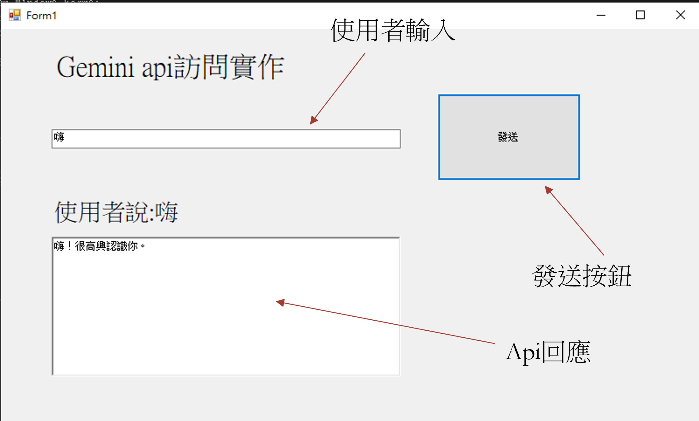

# Gemini.Net
一個透過windows form C#訪問gemini的圖形化介面

這只是一個簡單的實作，目前並無短期記憶功能

# 前置作業
用Visual Studio開啟 `gemini.NET.sln` 

在 `Form1.cs` 前面填入自己的api key

點擊Run或開啟 `gemini.NET\bin\Debug\gemini.NET.exe`

# 操作畫面

# 參考資料

### [JuroHsu/Gemini_Chat_For_CSharp](https://github.com/JuroHsu/Gemini_Chat_For_CSharp)

### [igorbock/GeminiCSharp](https://github.com/igorbock/GeminiCSharp)
